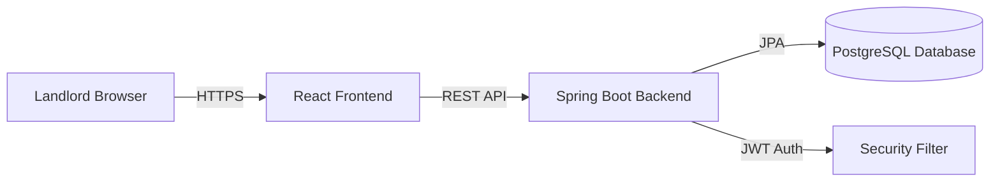
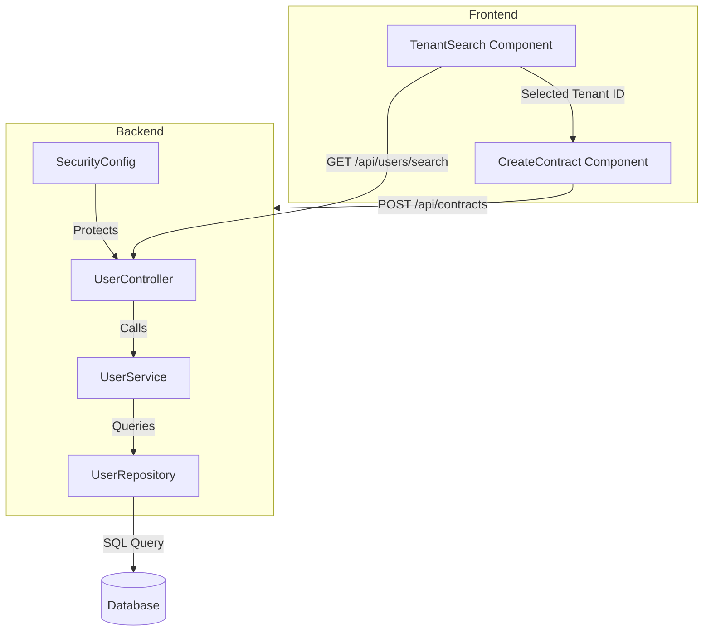

# Design Document: Tenant Search and Selection

## Overview

The tenant search and selection feature enables landlords to find and select registered tenant users during the contract creation process. This design extends the existing RentalPro system by adding a backend search API endpoint and updating the frontend contract creation UI to replace manual tenant input with a searchable dropdown component.

The solution consists of three main components:
1. **Backend Search API**: A new REST endpoint that queries the user database for tenants matching an email search string
2. **Repository Extension**: Enhanced UserRepository with a search method supporting partial email matching and role filtering
3. **Frontend Search Component**: A React-based searchable dropdown that provides debounced search, result display, and tenant selection

The design maintains the existing contract creation validation flow while improving the user experience by eliminating manual data entry and reducing errors from mistyped tenant information.

## Architecture

### System Context



### Component Architecture



### Request Flow

1. Landlord types in search field → Frontend debounces input (300ms)
2. Frontend sends GET request to `/api/users/search?email={query}`
3. Security filter validates JWT token and LANDLORD role
4. UserController receives request and calls UserService
5. UserService calls UserRepository.findByEmailContainingIgnoreCaseAndRole()
6. Repository executes SQL query with LIKE clause and role filter
7. Results mapped to DTO (id, name, email only) and returned to frontend
8. Frontend displays results in dropdown
9. Landlord selects tenant → Frontend stores tenant ID
10. On form submit → Frontend sends tenant ID to contract creation endpoint

## Components and Interfaces

### Backend Components

#### UserController

New REST controller for user-related operations.

```java
@RestController
@RequestMapping("/api/users")
public class UserController {
    
    private final UserService userService;
    
    @GetMapping("/search")
    public ResponseEntity<List<TenantSearchDTO>> searchTenants(
        @RequestParam String email,
        @AuthenticationPrincipal UserDetails userDetails
    ) {
        // Validate minimum query length
        if (email == null || email.trim().length() < 2) {
            return ResponseEntity.ok(Collections.emptyList());
        }
        
        List<TenantSearchDTO> results = userService.searchTenantsByEmail(email.trim());
        return ResponseEntity.ok(results);
    }
}
```

#### UserService

Service layer for user operations (new interface and implementation).

```java
public interface UserService {
    List<TenantSearchDTO> searchTenantsByEmail(String email);
}

@Service
public class UserServiceImpl implements UserService {
    
    private final UserRepository userRepository;
    
    @Override
    public List<TenantSearchDTO> searchTenantsByEmail(String email) {
        List<User> tenants = userRepository.findByEmailContainingIgnoreCaseAndRole(
            email, 
            Role.TENANT
        );
        
        return tenants.stream()
            .map(user -> new TenantSearchDTO(
                user.getId(),
                user.getName(),
                user.getEmail()
            ))
            .collect(Collectors.toList());
    }
}
```

#### TenantSearchDTO

Data transfer object for search results (excludes sensitive data).

```java
public class TenantSearchDTO {
    private UUID id;
    private String name;
    private String email;
    
    // Constructor, getters, setters
}
```

#### UserRepository Extension

Add search method to existing UserRepository interface.

```java
public interface UserRepository extends JpaRepository<User, UUID> {
    
    // Existing methods
    Optional<User> findByEmail(String email);
    boolean existsByEmail(String email);
    
    // New method for tenant search
    List<User> findByEmailContainingIgnoreCaseAndRole(String email, Role role);
}
```

#### SecurityConfig Update

Update security configuration to allow landlords to access search endpoint.

```java
@Configuration
@EnableWebSecurity
public class SecurityConfig {
    
    @Bean
    public SecurityFilterChain filterChain(HttpSecurity http) throws Exception {
        http
            .authorizeHttpRequests(auth -> auth
                // Existing rules...
                .requestMatchers("/api/users/search").hasRole("LANDLORD")
                // Other rules...
            );
        return http.build();
    }
}
```

### Frontend Components

#### TenantSearch Component

New React component for tenant search and selection.

```javascript
const TenantSearch = ({ onSelect, selectedTenant, error }) => {
    const [searchQuery, setSearchQuery] = useState('');
    const [searchResults, setSearchResults] = useState([]);
    const [isLoading, setIsLoading] = useState(false);
    const [isOpen, setIsOpen] = useState(false);
    const [searchError, setSearchError] = useState(null);
    
    // Debounced search function
    const debouncedSearch = useCallback(
        debounce(async (query) => {
            if (query.length < 2) {
                setSearchResults([]);
                return;
            }
            
            setIsLoading(true);
            setSearchError(null);
            
            try {
                const response = await axios.get('/api/users/search', {
                    params: { email: query }
                });
                setSearchResults(response.data);
                setIsOpen(true);
            } catch (err) {
                setSearchError('Failed to search tenants. Please try again.');
                setSearchResults([]);
            } finally {
                setIsLoading(false);
            }
        }, 300),
        []
    );
    
    const handleInputChange = (e) => {
        const value = e.target.value;
        setSearchQuery(value);
        debouncedSearch(value);
    };
    
    const handleSelect = (tenant) => {
        onSelect(tenant);
        setSearchQuery(`${tenant.name} (${tenant.email})`);
        setIsOpen(false);
        setSearchResults([]);
    };
    
    const handleClear = () => {
        setSearchQuery('');
        setSearchResults([]);
        onSelect(null);
    };
    
    return (
        <div className="tenant-search">
            <label>Search Tenant by Email</label>
            <div className="search-input-wrapper">
                <input
                    type="text"
                    value={searchQuery}
                    onChange={handleInputChange}
                    placeholder="Type tenant email to search..."
                    className={error ? 'error' : ''}
                />
                {selectedTenant && (
                    <button onClick={handleClear} className="clear-btn">×</button>
                )}
            </div>
            
            {isLoading && <div className="loading">Searching...</div>}
            
            {searchError && <div className="error-message">{searchError}</div>}
            {error && <div className="error-message">{error}</div>}
            
            {isOpen && searchResults.length > 0 && (
                <div className="search-results">
                    {searchResults.map(tenant => (
                        <div
                            key={tenant.id}
                            className="search-result-item"
                            onClick={() => handleSelect(tenant)}
                        >
                            <div className="tenant-name">{tenant.name}</div>
                            <div className="tenant-email">{tenant.email}</div>
                        </div>
                    ))}
                </div>
            )}
            
            {isOpen && searchQuery.length >= 2 && searchResults.length === 0 && !isLoading && (
                <div className="no-results">No tenants found matching "{searchQuery}"</div>
            )}
        </div>
    );
};
```

#### CreateContract Component Updates

Update existing CreateContract component to integrate TenantSearch.

```javascript
const CreateContract = () => {
    const [formData, setFormData] = useState({
        propertyId: '',
        tenantId: '',  // Changed from tenant object to just ID
        startDate: '',
        endDate: '',
        monthlyRent: '',
        securityDeposit: ''
    });
    
    const [selectedTenant, setSelectedTenant] = useState(null);
    const [errors, setErrors] = useState({});
    
    const handleTenantSelect = (tenant) => {
        setSelectedTenant(tenant);
        setFormData(prev => ({
            ...prev,
            tenantId: tenant ? tenant.id : ''
        }));
        // Clear tenant error when tenant is selected
        if (tenant) {
            setErrors(prev => ({ ...prev, tenant: null }));
        }
    };
    
    const handleSubmit = async (e) => {
        e.preventDefault();
        
        // Validate tenant selection
        if (!formData.tenantId) {
            setErrors(prev => ({ ...prev, tenant: 'Please select a tenant' }));
            return;
        }
        
        try {
            await axios.post('/api/contracts', formData);
            // Success handling
            setFormData({
                propertyId: '',
                tenantId: '',
                startDate: '',
                endDate: '',
                monthlyRent: '',
                securityDeposit: ''
            });
            setSelectedTenant(null);
            // Show success message
        } catch (err) {
            // Error handling
            if (err.response?.data?.message) {
                setErrors(prev => ({ 
                    ...prev, 
                    submit: err.response.data.message 
                }));
            }
        }
    };
    
    return (
        <form onSubmit={handleSubmit}>
            {/* Property selection field */}
            
            <TenantSearch
                onSelect={handleTenantSelect}
                selectedTenant={selectedTenant}
                error={errors.tenant}
            />
            
            {/* Other form fields */}
            
            <button type="submit">Create Contract</button>
        </form>
    );
};
```

## Data Models

### User Entity (Existing)

The existing User entity remains unchanged. Relevant fields:

```java
@Entity
@Table(name = "users")
public class User {
    @Id
    @GeneratedValue
    private UUID id;
    
    private String name;
    
    @Column(unique = true)
    private String email;
    
    private String password;  // Excluded from search results
    
    private String phone;  // Excluded from search results
    
    private String address;  // Excluded from search results
    
    @Enumerated(EnumType.STRING)
    private Role role;  // LANDLORD or TENANT
    
    // Other fields and methods
}
```

### TenantSearchDTO (New)

Lightweight DTO for search results containing only non-sensitive data:

```java
public class TenantSearchDTO {
    private UUID id;        // Required for contract creation
    private String name;    // Display in search results
    private String email;   // Display in search results and search matching
    
    public TenantSearchDTO(UUID id, String name, String email) {
        this.id = id;
        this.name = name;
        this.email = email;
    }
    
    // Getters and setters
}
```

### Database Query

The repository method generates SQL similar to:

```sql
SELECT u.id, u.name, u.email 
FROM users u 
WHERE LOWER(u.email) LIKE LOWER('%{query}%') 
  AND u.role = 'TENANT'
ORDER BY u.email ASC
LIMIT 10;
```

## Correctness Properties

*A property is a characteristic or behavior that should hold true across all valid executions of a system—essentially, a formal statement about what the system should do. Properties serve as the bridge between human-readable specifications and machine-verifiable correctness guarantees.*

### Property 1: Search returns only matching tenants

*For any* email search query and user database, all returned search results should have emails containing the query string (case-insensitive) AND have role TENANT, and no tenants matching these criteria should be excluded from results.

**Validates: Requirements 1.1**

### Property 2: Search results contain only safe fields

*For any* search result returned by the search endpoint, the result object should contain exactly the fields id, name, and email, and should not contain any sensitive fields such as password, phone, or address.

**Validates: Requirements 1.3, 1.4**

### Property 3: UI displays all result information

*For any* list of search results received by the Tenant_Selector, the rendered output should display each tenant's name and email.

**Validates: Requirements 2.1**

### Property 4: UI limits visible results

*For any* search result list containing more than 10 items, the Tenant_Selector should display a maximum of 10 visible items with scrolling enabled for additional results.

**Validates: Requirements 2.4**

### Property 5: Tenant selection populates form

*For any* tenant selected from search results, the Tenant_Selector should populate the form with that tenant's ID and display the tenant's name and email in the input field.

**Validates: Requirements 3.1, 3.2**

### Property 6: Dropdown closes on selection

*For any* tenant selection action, the search results dropdown should transition from open to closed state.

**Validates: Requirements 3.3**

### Property 7: Clear action resets state

*For any* selected tenant, performing a clear action should reset the input field to empty, clear the tenant ID from the form, and return the component to its initial searchable state.

**Validates: Requirements 3.4**

### Property 8: Contract submission sends tenant UUID

*For any* contract creation form submission with a selected tenant, the API request payload should contain the tenantId field with the selected tenant's UUID value.

**Validates: Requirements 4.1**

### Property 9: Successful submission resets form

*For any* successful contract creation response, the Contract_Creation_Flow should clear the tenant selection and reset all form fields to their initial empty state.

**Validates: Requirements 4.3**

### Property 10: Search requests are debounced

*For any* sequence of search input changes, search API requests should be delayed by at least 300 milliseconds from the last input change.

**Validates: Requirements 5.1**

### Property 11: Rapid typing cancels previous requests

*For any* new search input entered before the debounce delay expires, the previous pending search request should be cancelled and only the most recent search should execute.

**Validates: Requirements 5.2**

### Property 12: Loading indicator lifecycle

*For any* search request, a loading indicator should be visible while the request is in progress and should be removed when results are received or an error occurs.

**Validates: Requirements 5.3, 5.4**

### Property 13: Case-insensitive email matching

*For any* email search query, the User_Repository should return the same set of tenants regardless of the case (upper, lower, mixed) of the query string.

**Validates: Requirements 6.2**

### Property 14: Results ordered alphabetically

*For any* search query that returns multiple tenants, the results should be ordered alphabetically by email address in ascending order.

**Validates: Requirements 6.3**

## Error Handling

### Backend Error Handling

**Invalid Query Parameters**:
- Empty or null email query → Return empty list (not an error)
- Query length < 2 characters → Return empty list (not an error)
- Malformed requests → Return 400 Bad Request with error message

**Authentication/Authorization Errors**:
- Missing JWT token → Return 401 Unauthorized
- Invalid/expired JWT token → Return 401 Unauthorized
- User role is not LANDLORD → Return 403 Forbidden with message "Access denied"

**Database Errors**:
- Database connection failure → Return 500 Internal Server Error with generic message
- Query timeout → Return 500 Internal Server Error with message "Search timed out"
- Log detailed error information server-side for debugging

**Service Layer Errors**:
- Unexpected exceptions → Catch in controller, log details, return 500 with generic message
- Never expose internal error details or stack traces to client

### Frontend Error Handling

**Network Errors**:
- Request timeout → Display "Search request timed out. Please try again."
- Network unavailable → Display "Unable to connect. Please check your connection."
- Server error (5xx) → Display "Search failed. Please try again later."

**Authorization Errors**:
- 401 Unauthorized → Redirect to login page
- 403 Forbidden → Display "You don't have permission to search for tenants."

**Validation Errors**:
- No tenant selected on submit → Display "Please select a tenant" below search field
- Invalid form data → Display specific field errors from backend response

**Empty Results**:
- No tenants found → Display "No tenants found matching '{query}'" (not an error, informational)
- Query too short → Display no message, wait for more input

**State Management Errors**:
- Failed to update form state → Log error, attempt recovery by resetting component
- Debounce cancellation failure → Log warning, allow request to complete

### Error Recovery

**Backend Recovery**:
- Database connection pooling with automatic retry
- Circuit breaker pattern for external dependencies (if any)
- Graceful degradation: if search fails, allow manual tenant ID entry as fallback

**Frontend Recovery**:
- Automatic retry for transient network errors (max 2 retries with exponential backoff)
- Clear error messages with actionable guidance
- Preserve user input during error states
- Allow user to retry search without re-typing query

## Testing Strategy

### Dual Testing Approach

This feature requires both unit tests and property-based tests to ensure comprehensive coverage:

- **Unit tests**: Verify specific examples, edge cases, error conditions, and integration points
- **Property tests**: Verify universal properties across randomized inputs to catch edge cases that might be missed by example-based tests

Together, these approaches provide comprehensive coverage where unit tests catch concrete bugs and property tests verify general correctness across a wide input space.

### Property-Based Testing

**Framework**: Use appropriate PBT library for each language:
- Backend (Java): jqwik or QuickTheories
- Frontend (JavaScript/React): fast-check

**Configuration**:
- Each property test must run a minimum of 100 iterations
- Each test must include a comment tag referencing the design property
- Tag format: `// Feature: tenant-search-selection, Property {number}: {property_text}`

**Property Test Coverage**:

Each correctness property listed above must be implemented as a single property-based test:

1. **Property 1**: Generate random email queries and user databases, verify search returns only matching TENANT users
2. **Property 2**: Generate random search results, verify DTOs contain only id/name/email fields
3. **Property 3**: Generate random result lists, verify UI renders all names and emails
4. **Property 4**: Generate result lists with >10 items, verify only 10 visible with scrolling
5. **Property 5**: Generate random tenants, verify selection populates form with correct ID and display
6. **Property 6**: Generate random selections, verify dropdown closes
7. **Property 7**: Generate random selected states, verify clear returns to initial state
8. **Property 8**: Generate random tenant selections, verify API payload contains correct UUID
9. **Property 9**: Generate random successful responses, verify form resets
10. **Property 10**: Generate random input sequences, verify debounce timing
11. **Property 11**: Generate rapid input sequences, verify request cancellation
12. **Property 12**: Generate random search requests, verify loading indicator lifecycle
13. **Property 13**: Generate random queries with different cases, verify same results
14. **Property 14**: Generate random multi-result queries, verify alphabetical ordering

### Unit Testing

**Backend Unit Tests**:

*UserController Tests*:
- Test search with valid query returns results
- Test search with empty query returns empty list
- Test search with query < 2 chars returns empty list
- Test search without authentication returns 401
- Test search with TENANT role returns 403
- Test search with invalid token returns 401

*UserService Tests*:
- Test searchTenantsByEmail maps User entities to DTOs correctly
- Test searchTenantsByEmail excludes sensitive fields
- Test searchTenantsByEmail handles empty results

*UserRepository Tests*:
- Test findByEmailContainingIgnoreCaseAndRole with exact match
- Test findByEmailContainingIgnoreCaseAndRole with partial match
- Test findByEmailContainingIgnoreCaseAndRole filters by role correctly
- Test case-insensitive matching with uppercase query
- Test case-insensitive matching with lowercase query
- Test ordering by email alphabetically

*Integration Tests*:
- Test full search flow from controller to database
- Test security configuration allows LANDLORD access
- Test security configuration blocks TENANT access
- Test contract creation with valid tenant ID succeeds
- Test contract creation with invalid tenant ID fails

**Frontend Unit Tests**:

*TenantSearch Component Tests*:
- Test input change triggers debounced search
- Test search displays loading indicator
- Test search displays results
- Test search displays "no results" message
- Test search displays error message on API failure
- Test clicking result calls onSelect with correct tenant
- Test clear button resets component state
- Test selected tenant displays in input field

*CreateContract Component Tests*:
- Test tenant selection updates form state with tenant ID
- Test form submission includes tenant ID in payload
- Test form validation prevents submission without tenant
- Test successful submission resets form and tenant selection
- Test error response displays error message
- Test tenant selection clears validation error

*Integration Tests*:
- Test complete flow: search → select → submit contract
- Test error flow: search fails → displays error → retry succeeds
- Test validation flow: submit without tenant → error → select tenant → submit succeeds

### Edge Cases and Error Conditions

**Edge Cases to Test**:
- Empty search query
- Single character search query
- Search query with special characters (@, ., +, etc.)
- Search query with only whitespace
- Search results with exactly 10 items (boundary)
- Search results with 11 items (just over boundary)
- Tenant with very long name or email
- Multiple tenants with similar emails
- Rapid typing and immediate selection
- Selection followed by immediate clear
- Form submission during active search

**Error Conditions to Test**:
- Network timeout during search
- Server returns 500 error
- Server returns malformed JSON
- Authentication token expires during search
- User loses LANDLORD role mid-session
- Database connection failure
- Concurrent search requests
- Search request cancelled by user navigation
- Form submission with deleted tenant ID

### Test Data Generation

**Backend Test Data**:
- Generate users with various email patterns (gmail, corporate, subdomains)
- Generate users with both LANDLORD and TENANT roles
- Generate users with special characters in names and emails
- Generate large datasets (100+ users) for performance testing

**Frontend Test Data**:
- Generate search queries of varying lengths (0-50 characters)
- Generate result sets of varying sizes (0, 1, 10, 11, 50, 100 items)
- Generate tenants with edge case names (empty, very long, special chars)
- Generate API responses with various error codes and messages

### Performance Testing

While not part of unit/property tests, the following performance characteristics should be validated:

- Search query execution time < 200ms for databases with < 10,000 users
- Frontend debounce delay = 300ms ± 10ms
- UI renders search results in < 100ms
- Dropdown scrolling remains smooth with 100+ results
- Memory usage remains stable during repeated searches
